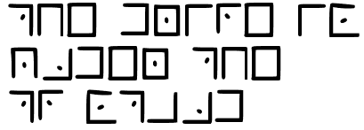

#  Decoding 4

## Our officers have obtained some encrypted messages. See if you can decode them.

1. What is the plaintext of the encrypted message?
After some research it appears it is the freemason alphabet, which can be decoded using a [tool](https://www.dcode.fr/pigpen-cipher).

  
Answer

    THE DRIVE IS UNDER THE TV STAND

