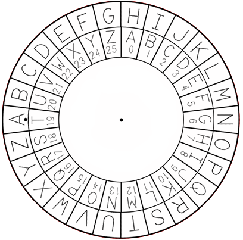

#  Decoding 5

### We found a cipher wheel along with several messages we suspect were encrypted with it. See if you can decode them.



```
=== Begin Encrypted Messages ===
1. set(A, T): INEE MAX YBKFPTKX HYY MAX YMI LXKOXK
2. set(B, D): UGPF OG VJG RCUUYQTF JCUJGU
==== End Encrypted Messages ====
```

<br></br>
1. What is the plaintext of the first message?
Subtracting the difference between the letters from 26 (the number of letters in the alphabet) gives us the number of letters shifted. Use a [tool](https://cryptii.com/pipes/caesar-cipher) to decode.
```python
>>> 26 - (ord('T') - ord('A'))
7
```

<details>
  <summary>Flag</summary>

    pull the firmware off the ftp server
</details>

<br></br>
2. What is the plaintext of the second message?
```python
>>> 26 - (ord('D') - ord('B'))
24
```

<details>
  <summary>Flag</summary>

    send me the password hashes
</details>
