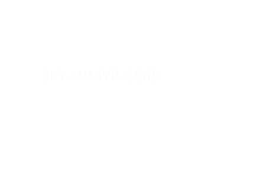
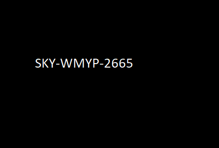

#  Stego 1

#### We know there is a hidden flag somewhere in the image, but it just looks black to us. See if you can make some sense out of it.

1. What is the hidden flag in the image?

The hint "it just looks back to us" tells us the flag is hidden in the image. An easy tool to test this with is [Stegsolve](http://www.caesum.com/handbook/Stegsolve.jar). The Color inversion (Xor) reveals the flag.

Flag

