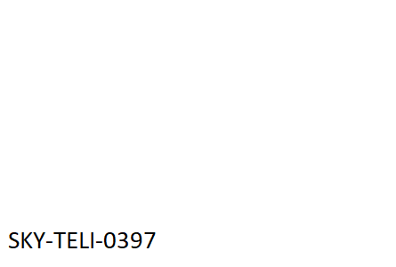

#  Stego 3

### Hackers have been trying to prevent us from viewing their images by converting them into data streams. See if you can revert them back to images.

1. What is the hidden flag?

Copying the first line of the text file and searching for it on google reveals references ro ImageMagic. It appears that an image had been converted to a text file. The [file format documentation](http://www.imagemagick.org/Usage/files/#txt) says that the file "basically lists each pixel in the image, one per line". I couldn't find a tool to convert the text file back to an image so I decided to write a python script.


<details>
<summary>Script</summary>

```python
import imageio
import numpy as np
from PIL import Image

def get_rgb(hex_color):
    h = hex_color.lstrip('#')
    return list(int(h[i:i+2], 16) for i in (0, 2, 4))

colors = {}
# Create a 445x300x3 array of 8 bit unsigned integers
data = np.zeros( (445,300,3), dtype=np.uint8 )

with open('Stego 3.txt') as f:
    for line in f:
        line_split = line.split(' ')
        color = line_split[3]
        x = int(line_split[0].split(',')[0])
        y = int(line_split[0].split(',')[-1].rstrip(':'))
        if color not in colors:
        colors[color] = get_rgb(color)
        data[x,y] = colors[color]
# flip image horizontally and rotate it 90° ccw
data = np.rot90(np.flip(data, axis=1))
Image.fromarray(data).show()
imageio.imwrite('Stego 3.png', data)
```
</details>


<details>
<summary>Flag</summary>


</details>
