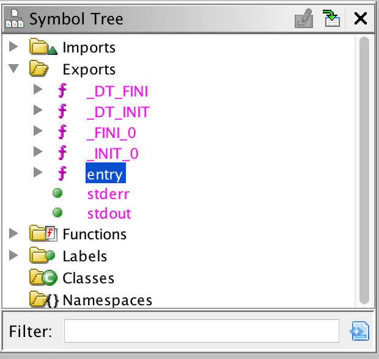
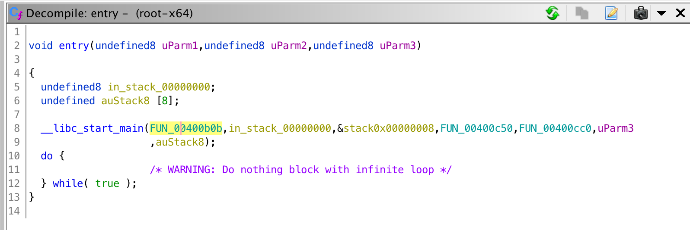
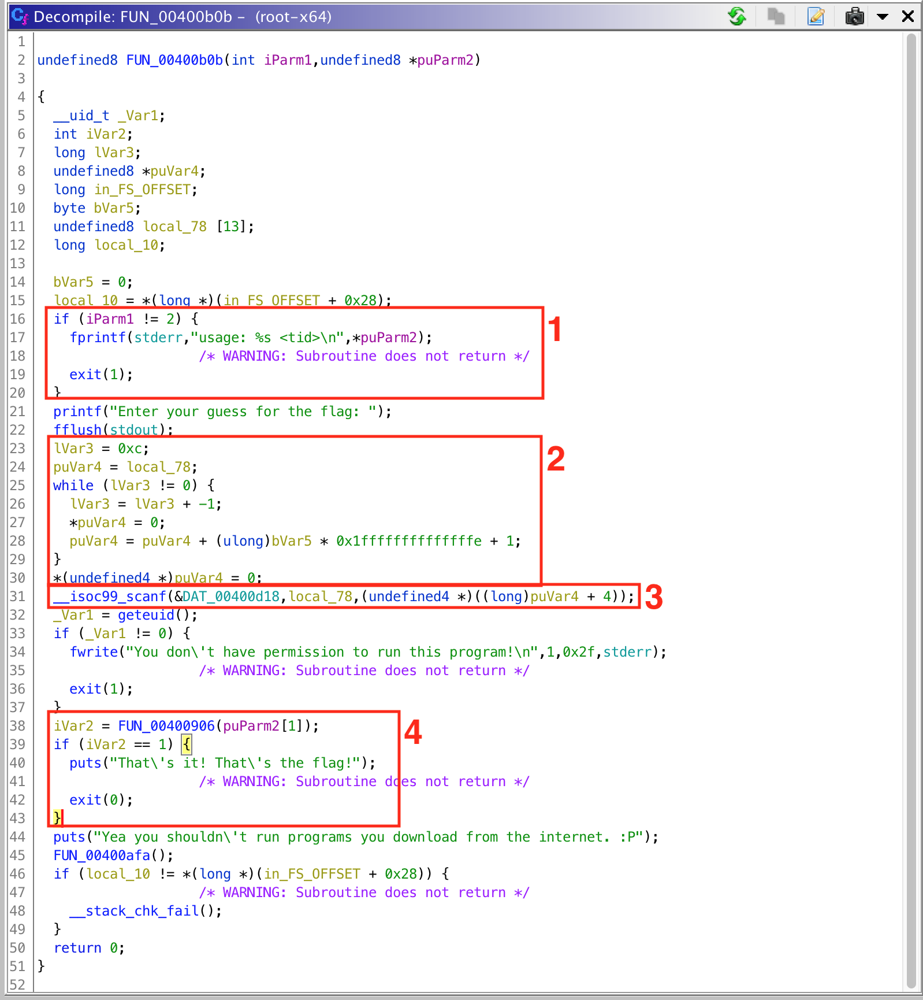

#  Root Cause

### We are having trouble getting this program to run. Inside it hides a secret that will lead us to the flag. Use tid value: 58dbc163b9b55b162220ce14ae9a2dfe for the challenge.

1. What is the value of the flag?
Since this is a compiled binary we will need a couple of tools.
* [Ghidra](https://ghidra-sre.org/): Free tool from NSA that has pretty good assembly view and a **free decompiler**
* [IDA](https://www.hex-rays.com/products/ida/support/download_freeware.shtml): Great tool for visual assembly analysis.
* [Binary Ninja](https://binary.ninja/demo/): Another great binary analysis tool with a better UI than IDA in my opinion. Limited to analysis of 32-bit x86 and ARMv7 binaries.

I first loaded the program into Ghidra to get a view of the decompiled code. The entry point can be found in the exports of the binary. This can be found in the Symbol Tree within Ghidra.



Clicking the entry symbol opens up a decompiled view of the entry function.



Double clicking the funciton name will load the user defined function. While the code is not very clean it is much easier to understand than assembly. There are a few key sections that become evident.



1. Input validation - tid must be passed as the first and only parameter.
2. Buffer zeroed - typical after creating space in memory.
3. User input - string is scanned from user input. A string of 13 characters is expected so it is assumed that is the desired flag.
4. Flag validation - based on the logic and program output, it seems this funciton validates the flag.

The most important part to me is the flag validation so I rename the function in the 4th section and double click it to begin analyzing it. The first thing I knotice is that the tid from the argument vector is passed and not the user input flag string. More on that later. Below is the entire function before analyzing and renaming variables:

<details>
<summary>Flag validation source</summary>

```cpp
undefined8 validate_flag(char *tid) {
    char *__s;
    size_t sVar1;
    undefined8 uVar2;
    long in_FS_OFFSET;
    int local_70;
    int local_6c;
    long local_68;
    int local_58 [4];
    undefined4 local_48;
    undefined4 local_44;
    undefined4 local_40;
    undefined4 local_3c;
    undefined4 local_38;
    undefined4 local_34;
    undefined4 local_30;
    undefined4 local_2c;
    undefined4 local_28;
    long local_20;

    local_20 = *(long *)(in_FS_OFFSET + 0x28);
    local_58[0] = 0x53;
    local_58[1] = 0x4b;
    local_58[2] = 0x59;
    local_58[3] = 0x2d;
    local_48 = 0x50;
    local_44 = 0x51;
    local_40 = 0x4e;
    local_3c = 0x4f;
    local_38 = 0xc;
    local_34 = 0x31;
    local_30 = 0x30;
    local_2c = 0x30;
    local_28 = 0x31;
    __s = getenv("AUTH");
    if (__s != (char *)0x0) {
        sVar1 = strlen(__s);
        if (sVar1 == 13) {
            local_68 = 0;
            local_70 = 0;
            while( true ) {
                sVar1 = strlen(tid);
                if (sVar1 <= (ulong)(long)local_70) break;
                local_68 = local_68 + (long)tid[(long)local_70];
                local_70 = local_70 + 1;
            }
            local_6c = 0;
            do {
                if (12 < local_6c) {
                    uVar2 = 1;
LAB_00400adf:
                    if (local_20 != *(long *)(in_FS_OFFSET + 0x28)) {
                        __stack_chk_fail();
                    }
                    return uVar2;
                }
                if (local_6c < 4) {
                    if ((int)__s[(long)local_6c] != local_58[(long)local_6c]) {
                        uVar2 = 0;
                        goto LAB_00400adf;
                    }
                }
                else {
                    if (local_6c == 8) {
                        if (__s[8] != __s[3]) {
                            uVar2 = 0;
                            goto LAB_00400adf;
                        }
                    }
                    else {
                        if (((long)__s[(long)local_6c] ^ local_68 % 10) != (long)local_58[(long)local_6c]) {
                            uVar2 = 0;
                            goto LAB_00400adf;
                        }
                    }
                }
                local_6c = local_6c + 1;
            } while( true );
        }
    }
    puts("Nope");
    /* WARNING: Subroutine does not return */
    exit(1);
}
```

</details>

The most important sections I see is the explicit declaration of 13 values (the length of a valid flag), the [loading of an environment variable](https://www.tutorialspoint.com/c_standard_library/c_function_getenv.htm) called "AUTH", and logical if-else blocks accompanied with an xor value check. I begin by renaming variables based on context and adding comments to each section for reference. Right clicking on the hex vales being loaded at the beginning of the function, we can choose to 'Convert' the hex values to ascii, revealing that the first four values being loaded match the flag format `SKY-`. I have re-written the function with more understandable variable names and logic flow.

<details>
<summary>Flag validation source (re-written)</summary>

```cpp
int validate_flag(char *tid) {
	/* local variable declarations */
	char *auth_env;
	size_t auth_env_len;
	size_t tid_len;
	int ret_val;
	long in_FS_OFFSET;
	int tid_idx = 0;
	int auth_env_idx;
	long tid_sum = 0;
	int flag_start [4];
	int local_48;
	int local_44;
	int local_40;
	int local_3c;
	int local_38;
	int local_34;
	int local_30;
	int local_2c;
	int local_28;
	long local_20;
	
	flag_start[0] = 'S';
	flag_start[1] = 'K';
	flag_start[2] = 'Y';
	flag_start[3] = '-';
	local_48 = 'P';
	local_44 = 'Q';
	local_40 = 'N';
	local_3c = 'O';
	local_38 = '\f'; // filler value
	local_34 = '1';
	local_30 = '0';
	local_2c = '0';
	local_28 = '1';

	auth_env = getenv("AUTH");
	/* make sure the flag was actually read from the environment */
	if (auth_env == (char *)0x0) exit(1);
	auth_env_len = strlen(auth_env);
	/* make sure the environment variable AUTH is a string of length 13 */
	if (auth_env_len != 13) exit(1);

	tid_len = strlen(tid);
	/* calculate the sum of the character values from the tid string */
	while( tid_idx < tid_len ) {
		tid_sum += tid[tid_idx];
		tid_idx++;
	}
	tid_sum %= 10;
	for (auth_env_idx = 0; auth_env_idx <= 12; auth_env_idx++) {
		/* make sure the first four characters match 'SKY-' */
		if (auth_env_idx < 4) {
			if (auth_env[auth_env_idx] != flag_start[auth_env_idx]) {
				exit(1);
			}
		}
		/* make sure the 9th character is the second '-' e.g. SKY-ABC- <-- */
		else if (auth_env_idx == 8) {
			if (auth_env[8] != auth_env[3]) {
				exit(1);
			}
		}
		/* xor the last 8 characters with the calculated tid sum */
		else {
			if ((auth_env[auth_env_idx] ^ tid_sum) != flag_start[auth_env_idx]) {
					exit(1);
			}
		}
	}
	puts("Nope");
	exit(1);
}
```

</details>

A python script can be written to emulate the same behavior and give us the desired flag.

<details>
<summary>Script</summary>

```python
# calculate the tid_sum value
tid = '58dbc163b9b55b162220ce14ae9a2dfe'
tid_sum = 0
for a in tid:
    tid_sum += ord(a)
tid_sum %= 10

# load values found in binary to list
arr_in_file = ['S', 'K', 'Y', '-', 'P', 'Q', 'N', 'O', '-', '1', '0', '0', '1']
# create empty list to store flag
flag = [None]*13

for idx, a in enumerate(arr_in_file):
	if idx < 4 or idx == 8: flag[idx] = a; continue
	flag[idx] = chr(ord(a)^tid_sum)

print(''.join(flag))

```

</details>

<details>
<summary>Flag</summary>

    SKY-TUJK-5445
</details>
